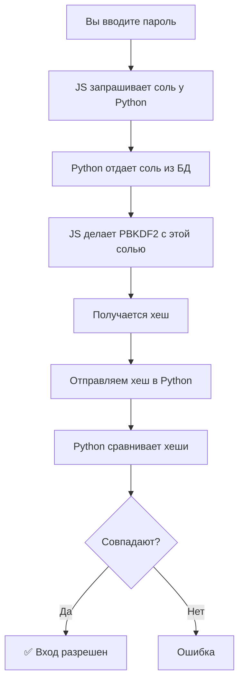

### PBKDF2 = Пароль + Соль + Итерации + Алгоритм хеширования SHA256

### SHA256:
    Входные данные 
    --> Добавление паддинга 
    --> Разбивка на блоки по 512 бит 
    --> Инициализация 8 констант 
    --> Для каждого блока 
    --> 64 раунда преобразований 
    --> Сложение с предыдущим хешем 
    --> Финальный хеш 256 бит

❌ Сервер остановлен
1. Откройте терминал VS Code
2. Активируйте: .\venv\Scripts\activate
3. Запустите: python app.py
4. Откройте: http://localhost:5000
